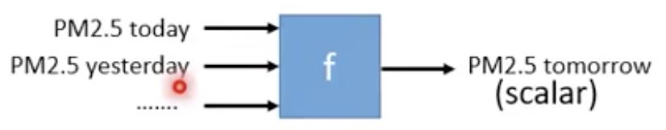

# 启蒙课程

此门课程主要是讲深度学习

## 函数

需要找到一个函数解决现实问题。

## Regression(回归)
要找的函数的输出是一个数值（scalar）。例如：PM2.5数值预测

## Classification(分类)
### 二分类
输出只有两个类：
RNN中输入句子，输出是正面还是负面

### 多分类
有多个输出类：从多个已知类中输出一个。
CNN中图像分类.

## Generation（生成）
生成句子或图片：

Supervised Learning
给机器输入带标签的数据进行训练：
评估函数的Loss，机器找出Loss最低的函数。

Reinforcement Learning
下棋中Supervised Learning VS Reinforcement Learning

监督学习是在每一步告诉它该怎么走；
强化学习是机器自己和自己下棋，在结束时给一个Reward（赢或输），让机器自己学习每一步该怎么走。
无监督学习
只给数据，没有标签。

Explainable AI
机器不但能给出结果，还能给出得到该结果的理由。

Adversarial Attack
加入刻意噪声的图片，使机器无法识别

Network Compression
异常检测
如何让机器知道一个输入属于一个它还不知道的分类

Transfer Learning
在训练资料和测试资料有不同的分布，仍然能学习到。

Meta Learning
让机器学习如何学习。
在这里插入图片描述

